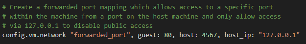

1/c Ryan Younes
17 SEP 2023

# Homework 1

## Tutorial 1: Automate Webserver Creation

First, I made a new directory html in which I inserted the HW 1 html file. After that, I made a new shell script copied from Vagrant's website, which sets up Apache each time the VagrantBox is started.

Code to make the directory for the html file provided:

```
mkdir html
```

Code for the shell script to start up Apache:

```
#!/usr/bin/env bash

apt-get update
apt-get install -y apache2
if ! [ -L /var/www ]; then
  rm -rf /var/www
  ln -fs /vagrant /var/www
fi
```

At the next part, I noticed that the script the Vagrant tutorial had included was already part of the Vagrantfile as comments (thanks to the HW document), and I proceeded to take the comments out to be included as code. After this, it started running the bootstrap shell I had written earlier at every start of the VM, making the Apache server available.


After I got the VM up, I successfully logged into the VM using SSH in the script.  Once I had made the server, I was able to use wget to access the HTML file I had set up for the machine.


## Tutorial 2: Configure Networking

In this tutorial, I included more code that was in the Vagrant file and connected to the host 4567. 



I was then able to access 127.0.0.1:4567 from my browser, as the VM had just set up the server on my local machine.


## Vagrant Provisioner: Shell

The Shell provisioner is used to upload and execute a script of applicable type within the guest machine. For instance, POSIX style machines will execute scripts with SSH, and Windows machines will execute scripts written for PowerShell and Batch with WinRM. I used it earlier in the homework to run the bootstrap.sh shell I had created to install and start Apache on the Ubuntu box for hosting the network. Within the Vagrantfile, you may: specify options for the provisioner, include inline scripts, link external scripts located on the host machine to be run, and provide script arguments for the script you wish to run.

 code:

```
config.vm.provision "shell", path: "bootstrap.sh"
```

## Question 5: Successful File Copy

Here, I placed a folder SuccessfulCopy containing a SuccessfulCopy.txt in the same directory as the Vagrant file, and included the following code provisioning the file copy from the host directory to the Documents folder on the Ubuntu machine I had.

```
config.vm.provision "file", source: "SuccessfulCopy", destination: "Documents"
```


