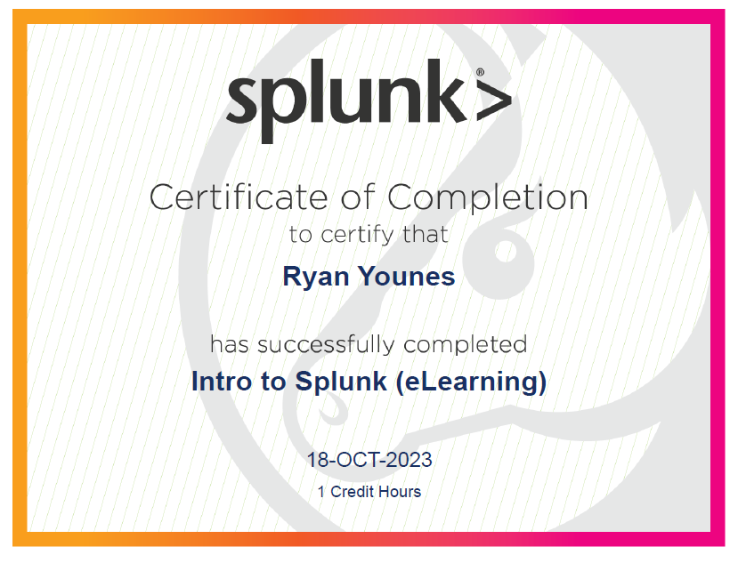

1/c Ryan Younes
18 OCT 2023

# Homework 6

## Splunk eLearning

I did the Intro to Splunk eLearning course, as I knew that I wanted to learn more tips on how I could best utilize searches for more specific fields based on my experience
with the previous lab CTF. During lab, it took me a long time to find out how to find specific items on the searches I would make, and I wanted to make it simpler to find specific information. I ended up learning a lot more than I thought I would about Splunk, including how to make visualizations of data, write and execute useful commands in search, and create dashboards to present information searched in the form of visualizations. One of the most useful things that the course had was information on how to run commands. For example, a command called count() after a pipe operator in the search terms will append all matching search terms to a specified list to be inspected and further sorted, which already allows for automatic dashboards with statistic information on events. It even shows where in the world the event originated from! Overall, it was a great resource that I plan to reference multiple times as we progress using Splunk.

## Blocked Windows Event: 5061

I chose to blacklist 5061, the Windows Event code for a cryptographic operation. More specficially, it generates when Microsoft Software Key Storage Provider or Microsoft Smart Card Key Storage Provider are activated in the creation or opening of a cryptographic key. A more detailed description is linked below:

https://learn.microsoft.com/en-us/windows/security/threat-protection/auditing/event-5061
