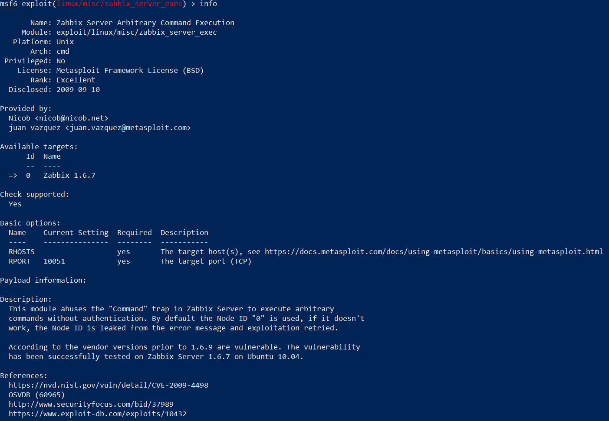

1/c Ryan Younes
24 OCT 2023

# Homework 7

## Vulnerable Service: Zabbix Server up to version 1.8

I used the search tool on the msfconsole in kali to find an exploit for ubuntu that worked using an exploitable server, calling upon its own network services, and I found one called Zabbix Server Arbitrary Code Execution. Zabbix is described as an open-source software tool to monitor IT infrastructure, collecting metrics on installed services. The exploit on Zabbix itself is very old, with the CVE having been created back in 2009, and in newer versions of Zabbix it has long since been patched. 

Zabbix uses port 10051 to conduct active checks for agents requesting its usage. When a packet makes a connection with the server listening on that port, the header of the packet that was sent to it is checked and searched for the phrase "Command". If it contains this, the insecure C function node_process_command() is called, which checks that the nodeid value in the packet is equal to the "NodeID" value enumerated in the Zabbix config file. Granted an attacker can even just run through a brute-force of possible NodeID values to send in the headers of packets of malicious code, the main condition for success of the exploit is fufilled. If it is, execute_script() is called, and both execute_script() and popen() are sent potentially malicious code to be run on the operating system. This will even return the result of the attacker's code back to them upon completion remotely.   

According to Metasploit, the exploit was used successfully for version 1.6.7 of Zabbix Server on Ubuntu 10.04. 

Links for reference:
Exploit-db.com
https://www.exploit-db.com/exploits/10432

Zabbix Support
https://support.zabbix.com/browse/ZBX-1030

## CVE and CWE details

CVE link:
https://nvd.nist.gov/vuln/detail/CVE-2009-4498

CWE link:
https://cwe.mitre.org/data/definitions/78.html

I found that the CVE is listed as CVE-2009-4498. Its base score under the Common Vulnerability Scoring System version 3 is still awaiting reanalysis according to NVD Analysts, however, it scores a 6.8 under version 2 of the same scoring system. Its description still refers to how the exploit takes advantage of using the node_process_command C function to gain access to the operating system through Zabbix Server, allowing arbitrary execution of code.

This CVE belongs to CWE-78, Impoper Neutralization of Special Elements used in an OS Command ('OS Command Injection'). 

