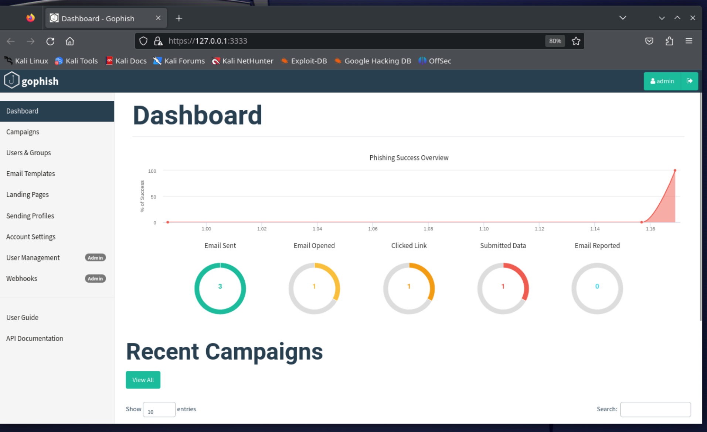

1/c Ryan Younes
16 NOV 2023

# Homework 8

## Security Tool: Gophish

A type of attack I have always been interested in is phishing. How is it so easy to make a phishing campaign? Most phishing emails can barely convince me the sender even knows English. I looked through the tools on Kali Linux relating to phishing and found a program called gophish. It's started and stopped through the terminal, but runs entirely through a GUI accessed on port 3333 through the browser on the localhost. Written in the GO programming language and open-source software, it is available to multiple operating systems, including Windows and Linux distributions. It is ultra-simple to use, step by step clarifying how to set up profiles to impersonate, landing pages for unwitting victims to enter their information into, as well as users/groups to enact the phishing on. Once all these are configured, the user identifies where the GoPhish server for the landing pages are, and the campaign starts. A statistics analysis dashboard identifies with timestamps when the email was sent, opened, bait taken, and even when data was submitted. Overall, this tool is ideal for any skill level to gauge how vulnerable an organization is to phishing attacks.

## Usage of GoPhish to enact a phishing campaign with multiple users

I elected to go the difficult route, making the service compatible with other hosts on the network as well as emulating phishing attacks.

GoPhish was already installed on kali, of course, and starting the server was easy. It gave me the username and password to use once I had started the service.

Once I had logged in, it was time to start creating my alias to phish from. I elected to set up an old burner Gmail account I had on hand to expect GoPhish to connect to it, and made sure to clarify that it would be sending emails through that Gmail I had provided. I made sure to test the service using the built-in test email functionality, which worked

Next up was setting up the landing page. Since I wanted to enact a Metallica phishing scheme, I found and inputted the user login page for the Metallica site. This would work well to collect a superfan's credentials to the site.

Next was the Email templates. I had already gotten a pretty solid promotion email from the official Metallica site coaxing users to sign in to the site. I copied the url and the program did the rest for me! Simple and little effort put in on my part here, all while making an extremely convincing looking email. No wonder it is popular.

Last I set up Users and Groups to send to. I elected to send the email to myself as well as 1/c Ethan To and 1/c Jake Carpenter (with personal emails of course.)

In the end, I specified when to start the email campaign, as well as the previously set up fields. I ended up getting the email myself and I would have gotten phished!

Of course I had to put in a redirect page...

